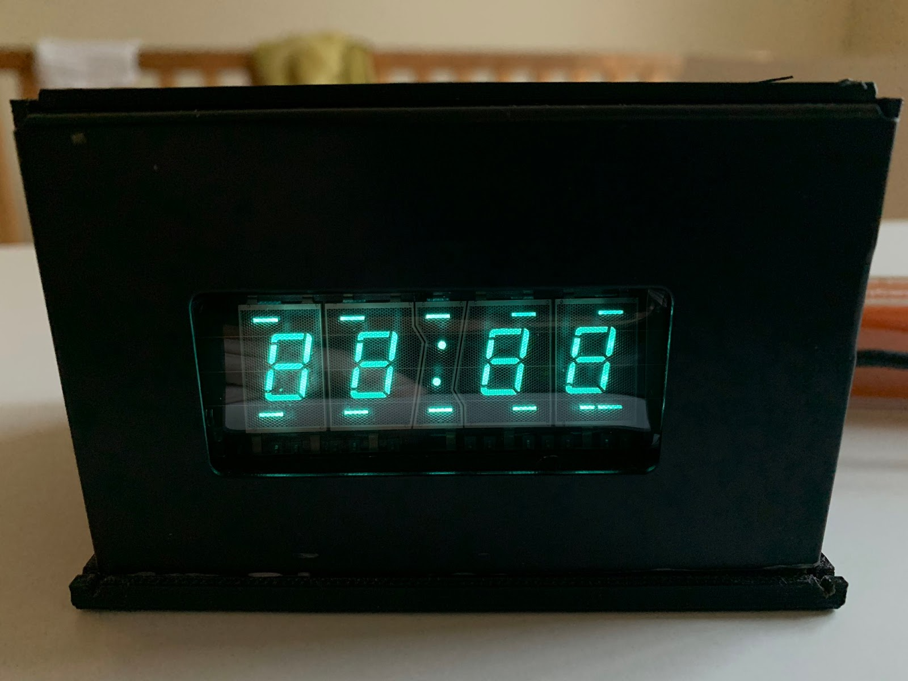

# VFD
Arduino library for vacuum fluorescent displaysd, such as found in electronics and appliances. 
With this library I am trying to provide some shortcuts to programming any vacuum fluorescent appliance/electronics display provided it is multiplexed, that is, its circuit has several grid pins to address specific digits with individual pins for segments across digits. 
## Where to get them
VFDs can be found in common discarded appliances such as microwaves and DVD/VCR players, and electronics. <a href="https://metatek.blogspot.com/2020/01/vacuum-fluorescent-display-adventures.html" target="_blank">See this tutorial</a> for tips on circuitry.
## Usage
<b>Include the library</b> 
<code>
  #include <VFD.h>
  </code>
   
  <b>Create the display instance</b> 
Because displays vary in their number of grids for multiplexing and segments in each digit this data is passed to the instance through grid and segment pin arrays. Before creating these arrays follow <a href="https://slomkowski.eu/tutorials/determining-the-pinout-of-the-unknown-vacuum-fluorescent-display/" target="_blank">this tutorial</a> to set up a power circuit to determine grid and segment pins. Constructing a pinout diagram will help to map out which pins control each grid, and which pins control the segments. 
Now create the digit and segment data that will be passed to the object instance, as in this example: 
   
  This dislay is only slightly non-standard because of the additional segments for the colon, and the lines above and below the digits.
  <pre>
	const int NUM_SEG_PINS = 9;
	const int NUM_GRID_PINS = 5;
	const int segments[] = {8,7,6,5,4,3,2, A1, A0};
	const int grids[] = {13, 12, 11, 10, 9};
	VFD disp(NUM_SEG_PINS, segments, NUM_GRID_PINS, grids);
  </pre>
   
  In the above, variables are declared for the number of segment and grid pins, and the pin sequence for the segments and grid arrays are constructed as follows: 
  1) If numbers are possible and desired, sequence the segment pins in order for the first 7 pins to display the 7 conventional segments for a number digit, that is:
  <pre>
     A 
  F     B 
     G 
  E     C 
     D
     </pre>
  This will allow you to use a convenient number function that assumes pins arranged in that order. 
  2) Order grid pins from right to left. 
	
  ## Useful functions (so far)
  <code>disp.on(int duration)</code>: all segments on, multiplexed across all grids for even power distribution. 
	<code>disp.off(int duration)</code>; all digits and segments set against LED bias 
	<code>disp.blink(int duration)</code>; alternates on and off for duration passed as argument 
	<code>disp.segment(int d, int s)</code>; Turn on segment specified (but does not turn it off). 
	<code>disp.segment(int d, int s, int duration)</code>; Turn on segment specified on digit specified for given duration in ms. 
	<code>disp.number(int d, int num)</code>; If segments are sequenced according to conventional number segment mapping (see above) will display number 0-9 on digit specified. On for 5 ms. 
	<code>disp.multiDigitNumber(int num)</code>; If segments are sequenced according to conventional number segment mapping (see above) and digits are sequenced right to left, will display integers up to 99999, right justified. Multiplexed, 5 ms per digit. Note this can only work if the digit grids are adjacent. In the above example VFD the colon grid messes up 3- or more digit numbers. 
	<code>disp.crazyEights(int speed)</code>; Run an 8 pattern of segments on all digits, if segments are sequenced according to conventional number segment mapping (see above).
  ## Multiplexing different elements
  Let's say you want different multiplexed elements to alternate, like a multi-digit number to blink. You can't use a delay because the current element will be blocked at it's last multiplexed item. My solution is to use a state variable that changes via a timer condition:
  <pre>
byte state = 0;
int delayTime = 500;
double lastChange = 0;
void loop() {
  if (state == 0) {
    disp.multiDigitNumber(365);
  } else if (state == 1) {
    disp.on(20);
  } else {
    disp.off(0);
  }
  if (millis() > lastChange + delayTime) {
    state++;
    if(state > 2) state = 0;
    lastChange = millis();
  }
}</pre>
