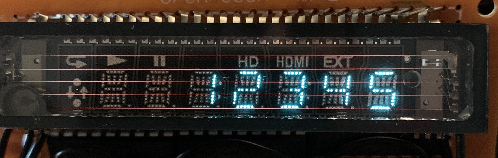

# VFD
Arduino library for vacuum fluorescent displaysd, such as found in electronics and appliances. 
With this library I am trying to provide some shortcuts to programming any vacuum fluorescent appliance/electronics display provided it is multiplexed, that is, its circuit has several grid pins to address specific digits with individual pins for segments across digits.  
(NOTE functions using alpha characters are not space efficient and may max out memory use or cause instability on some boards: Adafruit Metro Mini and Arduino UNO are affected in my experience. )
## Python version
Now available a <a href="https://github.com/enauman/vfd/tree/master/python">Python version</a> for use on a Raspberry Pi circuit.
## Where to get them
VFDs can be found in common discarded appliances such as microwaves and DVD/VCR players, and other electronics. It would be cool to get one out of a car dashboard.
## Circuit
Connecting a microcontroller to a display requires a ~3V circuit to power the filament, a ~21V circuit to power the grids and segments, and a transistor array also connected to each grid and segment to allow the microcontroller to turn them on and off (turning a grid or segment on is done by setting the pin LOW and turning it off by setting it HIGH.) 
<a href="https://metatek.blogspot.com/2020/01/vacuum-fluorescent-display-adventures.html">This post</a> describes my initial project using an Adafruit Metro Mini 5V. 
More detail about how I've been making the circuits most recently can be found <a href="circuits.md">here.</a> 
## Usage
<b>Include the library</b> 
<code>
  #include <VFD.h>
  </code>
   
  <b>Create the display instance</b> 
Because displays vary in their number of grids for multiplexing and segments in each digit this data is passed to the instance through grid and segment pin arrays. Before creating these arrays follow <a href="https://slomkowski.eu/tutorials/determining-the-pinout-of-the-unknown-vacuum-fluorescent-display/" target="_blank">this tutorial</a> to set up a power circuit to determine grid and segment pins. Constructing a pinout diagram will help to map out which pins control each grid, and which pins control the segments. 
Now create the digit and segment data that will be passed to the object instance, as in this example: 
   
  This dislay is only slightly non-standard because of the additional segments for the colon, and the lines above and below the digits.
  <pre>
	const byte NUM_SEG_PINS = 9;
	const byte NUM_GRID_PINS = 5;
	const byte segments[] = {8,7,6,5,4,3,2, A1, A0};
	const byte grids[] = {13, 12, 11, 10, 9};
	VFD disp(NUM_SEG_PINS, segments, NUM_GRID_PINS, grids);
  </pre>
   
  In the above, variables are declared for the number of segment and grid pins (NOTE byte data type), and the pin sequence for the segments and grid arrays are constructed as follows: 
  1) If numbers are possible and desired, sequence the segment pins in order for the first 7 pins to display the 7 conventional segments for a number digit, that is:
  <pre>
     A 
  F     B 
     G 
  E     C 
     D
     </pre>
  This will allow you to use a convenient number function that assumes pins arranged in that order. 
  2) Order grid pins from right to left. 
	
## 9-segment numbers option

When you create the display object you can add a 5th argument for numbers to use 9 segments as with this type of display:

 
<pre>const byte numberSegments = 9; 
VFD disp(NUM_SEG_PINS, segments, NUM_GRID_PINS, grids, numberSegments);</pre> 
As with 7-segment configuration, first 9 pins in the segment pins array should be in the following order: 
  <pre>
     A 
  F     B 
   G H I 
  E     C 
     D
     </pre>
 If no 5th argument is given the display object defaults to a 7-segment number configuration, but you can also add 7 as a 5th argument: 
 <pre>const byte numberSegments = 7; 
VFD disp(NUM_SEG_PINS, segments, NUM_GRID_PINS, grids, numberSegments);</pre> 

## Alphanumeric characters for "star", or 15-segment digits
 
With segments in the above arrangement you can display alphanumeric messages using the letter, message, and scrollingMessage functions. To do so, order the first 15 pins in the segments array in this order: 
<pre>
     A 
 F J K L B 
   G H I 
 E M N O C 
     D
   </pre>
	
  ## Useful functions
  <code>disp.on()</code>: all segments on, all grids on. 
	<code>disp.off(int duration)</code>; all digits and segments off 
	<code>disp.blink(int duration)</code>; alternates on and off for duration passed as argument, non-blocking 
	<code>disp.segment(byte g, byte s)</code>; Turn on segment specified (but does not turn it off). 
	<code>disp.segment(byte g, byte s, int duration)</code>; Turn on segment specified on digit specified for given duration in ms. 
	<code>disp.number(byte g, byte num)</code>; If segments are sequenced according to conventional number segment mapping (see above) will display number 0-9 on digit specified. On for 5 ms. 
	<code>disp.multiDigitNumber(int num)</code>; If segments are sequenced according to conventional number segment mapping (see above) and digits are sequenced right to left, will display integers up to 99999, right justified. Multiplexed, 5 ms per digit. Note this can only work if the digit grids are adjacent. In the above example VFD the colon grid messes up 3- or more digit numbers. 
	<code>disp.multiDigitNumber(byte g, int num)</code>; Same as previous but rightmost digit of the multi-digit number can be set by <i>byte g</i>.  
	<code>disp.crazyEights(int speed)</code>; Run an 8 pattern of segments on all digits, if segments are sequenced according to conventional number segment mapping (see above). This will work on the 9-segment number display option mentioned above as well if you add '9' as the 5th argument to the display object instance. 
	<code>disp.letter(byte g, char whichLetter)</code>; Display a letter, a-z, in grid specified. All letters displayed as upper case.  
	<code>disp.message(String text, byte firstGrid, byte lastGrid, int waitTime)</code>; Display a string comprised of a-z and 0-9, overflow characters will be separated into substrings which will alternate blinking pattern, blinking speed defined with waitTime. Required firstGrid and lastGrid args define grid range (right and left), inclusive, to use. 
	<code>disp.scrollingMessage(String text, byte firstGrid, byte lastGrid, int waitTime)</code>; Display a string comprised of a-z and 0-9, scrolling right to left, scrolling speed defined with waitTime. Required firstGrid and lastGrid args define grid range (right and left), inclusive, to use. 
	
  ## Multiplexing different elements
  Let's say you want different multiplexed elements to alternate, like a multi-digit number to blink. You can't use a delay because the current element will be blocked at its last multiplexed state. My solution is to use a state variable that changes via a timer condition:
  <pre>
byte state = 0;
int delayTime = 500;
double lastChange = 0;

void setup() {}

void loop() {
if (state == 0) {
    disp.multiDigitNumber(123);
  } else {
    disp.off(0);
  }
  if (millis() > lastChange + delayTime) {
    state = !state;
    lastChange = millis();
  }
}
</pre>
