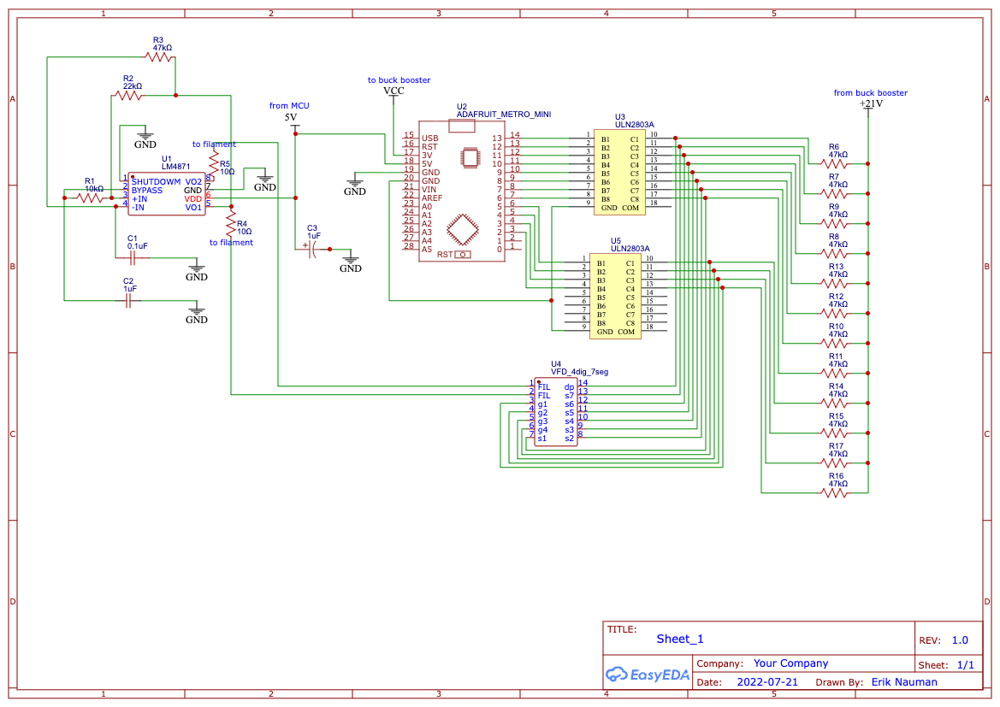

# Circuit details
The following is an example circuit, illustrating how a very simple 4-digit, 7 segment + decimal point (dp) would be driven with a MCU, in this case the Adafruit Metro Mini. For most VFDs the Metro Mini doesn't provide enough GPIO pins so I've used different versions of the Teensy board. Even the Teensy LC has 25 GPIO pins. 
In this circuit the filament is driven with an LM4871 chip which provides a square wave across the filament. The 10Ω value of R4 and R5 can be changed to a lower value to increase the brighness of the display if needed. Sometimes the sweet spot for the filament current requires a bit of experimentation. 
A buck booster <a href="https://www.amazon.com/dp/B0CWKWX7QC?ref=ppx_yo2ov_dt_b_fed_asin_title">such as this</a> is used to boost voltage from the 3.3V pin on the MCU to 21V for the grid and segment pins. 
 
